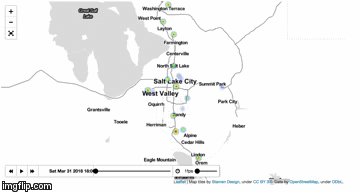

# aqandu

## Running on localhost

* In order to do a cross domain request you have to download [Cors Chrome extension](https://chrome.google.com/webstore/detail/cors-toggle/jioikioepegflmdnbocfhgmpmopmjkim)

  * Download Cors and add https://air.eng.utah.edu/dbapi/api/rawDataFrom to the 'intercepted URLs or Patterns'

* Navigate to the [WebApp](https://github.com/nguyenmichelle/aqandu/tree/master/WebApp) folder then start the python server


### If Python version returned above is 3.X
```
python -m http.server
```

### If Python version returned above is 2.X
```
python -m SimpleHTTPServer
```

### The app should be defaulted to serve on port 8000
http://localhost:8000/WebApp/

<p align="center">
  
</p>
